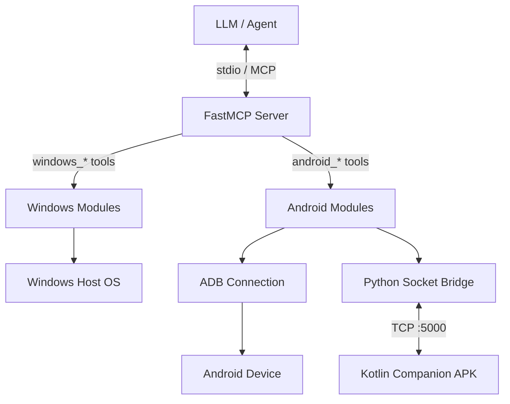

# System-MCP Architecture

System-MCP is a dual-platform (Windows & Android) automation bridge designed for LLM agents utilizing the Model Context Protocol (MCP).

## Unified MCP Server

The core of the project is the `mcp_server.py`, built on top of `FastMCP`.
Instead of requiring LLMs to connect to separate Android and Windows servers, System-MCP unifies them.

## Android Module Architecture

Because standard Android sandboxing blocks background clipboard access (Android 10+) and direct UI introspection without an active app, the Android integration uses a two-pronged approach:

1. **ADB Commands (`system_mcp/android/connection.py`)**: For system-level tasks (launching apps, listing packages, toggling Wi-Fi, basic shell commands), Python routes raw `adb -s <serial>` commands directly to the device.
2. **Companion Bridge (`system_mcp/android/companion/bridge.py`)**: For privileged UI tasks (clipboard reading, fetching the Accessibility Tree, streaming notifications, writing to Secure Settings), Python talks over a forwarded TCP socket (port 5000) to the Kotlin Companion App running as a Foreground Service.

### The Kotlin Companion App

The app (`system_mcp/companion`) is built to run entirely headless.
- `CompanionService.kt`: The main entry point. Runs a TCP socket server on `127.0.0.1:5000`. Expects a JSON payload prefixed with a 4-byte big-endian length header.
- `MCPAccessibilityService.kt`: Bypasses Android 10 clipboard restrictions and dumps the full UI tree.
- `MCPNotificationListener.kt`: Captures live notifications and broadcasts them over the socket to Python.
- `BootReceiver.kt`: Automatically flips `adb_wifi_enabled = 1` in Android Secure Settings on device boot, ensuring wireless ADB persists across restarts.

## Security & Destructive Gates

System-MCP gives an AI agent extreme power. To prevent accidental formatting, looping reboots, or data deletion, the `core/audit.py` module enforces safety:

1. **The JSONL Audit Trail**: Every function call made by the LLM is written to `~/.system-mcp/audit.jsonl`.
2. **`check_destructive`**: Functions like `reboot`, `shutdown`, `uninstall`, and `kill` require the LLM to explicitly pass `confirm=True`. If the agent forgets, the framework raises a `RequiresConfirmation` error, forcing the agent to rethink its action.
